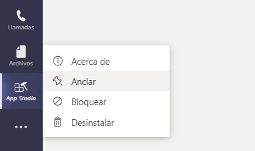
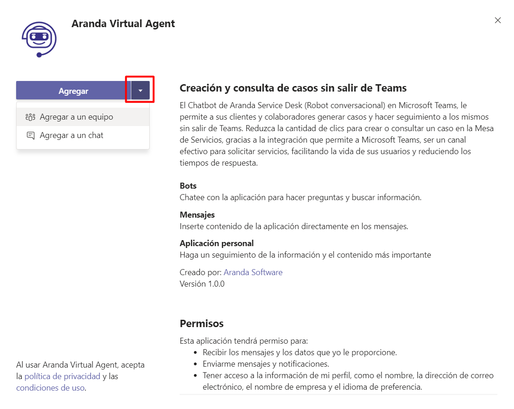
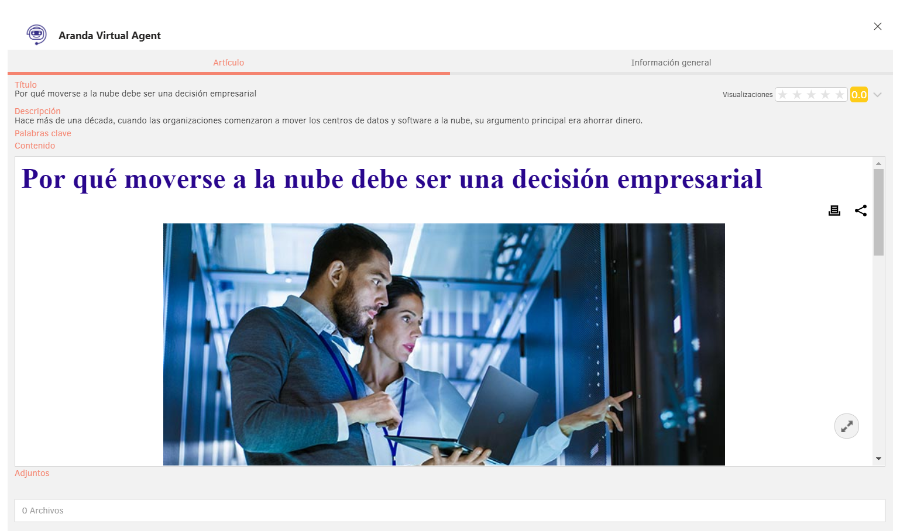

# Untitled

Manual de

instalación y uso

Aranda Virtual Agent

2020 Aranda Software - Todos los derechos reservados

## Tabla de contenido

[Tabla de contenido 2]()

[1. Introducción 3]()

[2. Prerrequisitos 3]()

[2.1. Configuración previa en Microsoft Teams 3]()

[2.2. Configuración previa en Aranda Service Desk 4]()

[3. Instalación de Aranda Virtual Agent en Teams 6]()

[4. Configuración de Aranda Virtual Agent en Teams 12]()

[5. Uso de Aranda Virtual Agent 17]()

[5.1. Crear un caso 17]()

[5.2. Consultar un caso 20]()

[5.3. Buscar un caso 22]()

[5.4. Buscar un artículo 23]()

[6. Consideraciones importantes 25]()

## Introducción

Aranda Virtual Agent es una extensión que permite interactuar con la mesa de servicios Aranda Service Desk desde el entorno de Microsoft Teams.

## Prerrequisitos

El cliente debe contar con:

* Licencias activas de Microsoft Office y Microsoft Teams.
* Aranda Service Desk versión mínima **8.24.3** con base de datos **8.0.110**, como servicio en la nube de Aranda, o en instalación on-premise.
* Un usuario nombrado en Aranda Service Desk para la conexión con Teams.
* El ambiente de Aranda que se conecte con el bot debe estar bajo un dominio con protocolo seguro \(**https**\) obligatoriamente.

### Configuración previa en Microsoft Teams

**Habilitar la carga de aplicaciones personalizadas en Teams**

Desde el panel de administración de Microsoft Teams \(usuario autorizado\) diríjase a **Aplicaciones de Teams &gt; Directivas de configuración** y active la opción **Cargar aplicaciones personalizadas**.

En el pequeño icono junto a la opción encontrará una explicación y un enlace a la documentación de Microsoft.

### Configuración previa en Aranda Service Desk

Se deben configurar dos nuevos grupos de trabajo: Teams Manager y Teams Client.

Así mismo se deben crear dos nuevos usuarios: tmanager y tclient.

Estos usuarios deben asociarse a los respectivos grupos de trabajo anteriormente creados y luego se les deben asignar los dos permisos correspondientes a cada grupo de trabajo así:

<table>
  <thead>
    <tr>
      <th style="text-align:left"><b>Grupo de trabajo y usuario</b>
      </th>
      <th style="text-align:left">
        
Permisos en la consola de administraci&#xF3;n

        
<b>Aranda Service Desk BLOGIK</b>
        

      </th>
      <th style="text-align:left">
        
Permisos en la consola de especialistas

        
<b>Aranda Service Desk FRONT END</b>
        

      </th>
    </tr>
  </thead>
  <tbody>
    <tr>
      <td style="text-align:left">Teams Manager -&gt; tmanager</td>
      <td style="text-align:left">
        <ul>
          <li>APPLICATION EXECUTE</li>
          <li>TEAMS MANAGER</li>
        </ul>
      </td>
      <td style="text-align:left"></td>
    </tr>
    <tr>
      <td style="text-align:left">Teams Client -&gt; tclient</td>
      <td style="text-align:left"></td>
      <td style="text-align:left">
        <ul>
          <li>APPLICATION EXECUTE</li>
          <li>TEAMS CLIENT</li>
        </ul>
      </td>
    </tr>
  </tbody>
</table>

Posteriormente, en el servidor donde se encuentre instalada la aplicación de Aranda Service Desk USDKv8 \(consola de usuario\):

1. Diríjase a la ruta de instalación \(generalmente es C:\inetpub\wwwroot\USDKV8\) y una vez allí, ubique el archivo llamado Web.config

1. Abra el archivo con un editor de texto y ubique la siguiente línea:

 &lt;add name="X-Frame-Options" value="SAMEORIGIN" /&gt;.

1. Una vez ubicada, reemplácela por la siguiente línea:

&lt;add name="Content-Security-Policy" value="frame-ancestors 'self' teams.microsoft.com \*.azurewebsites.net"/&gt;

1. Guarde los cambios y reinicie el IIS.

## Instalación de Aranda Virtual Agent en Teams

**NOTA:** Este es el proceso de instalación sin utilizar la tienda de Microsoft Teams

1. Ingrese a Teams y haga clic en el icono de tres puntos.

1. En la ventana emergente que aparece, haga clic en **Más aplicaciones**.

1. Con ayuda del buscador encuentre la aplicación App Studio y haga clic en ella.

1. Haga clic en el botón **Agregar**.

1. Si desea anclar el icono de App Studio, haga clic derecho sobre la aplicación y seleccione la opción **Anclar**.

1. Diríjase a la pestaña **Manifest editor**.

1. Haga clic en **Import an existing app**.

1. En el explorador de archivos que se muestra, seleccione el archivo compilado **ArandaVirtualAgent.zip** suministrado por Aranda.

Una vez cargado, visualizará la aplicación creada.

1. Seleccione la aplicación, diríjase a la opción **Test and distribute** y luego haga clic en **Install**.

1. Haga clic en **Agregar**.

Al finalizar la instalación, automáticamente llegará al chat un mensaje de saludo del bot de Aranda Virtual Agent.

## Configuración de Aranda Virtual Agent en Teams

Para configurar el servicio de Aranda Virtual Agent en Teams siga los siguientes pasos:

1. Haga clic en la pestaña **Configuración**.

1. Ingrese los siguientes datos en los campos solicitados y haga clic en **Ingresar**:

* **USDK BackEnd Url:** [https://win201902.arandasoft.com/ASDKAPI/](https://win201902.arandasoft.com/ASDKAPI/)
* **Usuario:** tmanager
* **Contraseña:** ABC123
* **Email Corporativo:** Email corporativo \(user@arandasoft.com\)
* **Versión:** V8

Aparecerá la siguiente ventana emergente:

1. Ingrese los siguientes datos en los campos solicitados y haga clic en **Crear**:

* **USDK Front End:** URL de la consola USDKV8.
* **USDK Back End Url:** URL del API de ASDKV8.
* **Usuario:** usuario TEAMS CLIENT \(tclient\)
* **Contraseña:** contraseña Usuario TEAMS CLIENT.
* **Correo Corporativo:** email corporativo \(user@arandasoft.com\)
* **Versión:** V8
* **Activa:** marcar la casilla

Aparecerá la siguiente ventana con la configuración realizada:

1. Regrese a App Studio, diríjase a la pestaña a **Manifest editor** y seleccione la aplicación Aranda Virtual Agent.

1. Diríjase a la opción **Test and distribute** y luego haga clic en **Install**.

1. Haga clic en la flecha ubicada al lado derecho de **Agregar** y seleccione **Agregar a un equipo** o **Agregar a un chat**, según requiera. El chat o equipo debe haberse creado y configurado previamente en Teams de acuerdo a las necesidades o utilización que se le vaya a dar al bot.

1. Busque el chat o equipo y haga clic en **Configurar un bot**.

Al finalizar la configuración, automáticamente llegará al chat un mensaje de saludo del bot de Aranda Virtual Agent.

## Uso de Aranda Virtual Agent

Desde el canal o chat autorizado para este uso, los usuarios pueden invocar la ayuda del bot digitando “@Aranda Virtual Agent”, “ayuda” o “help” y el bot mostrará un mensaje con un breve instructivo de uso.

Si durante la interacción con el bot usted selecciona una opción incorrecta o no desea continuar, puede terminar enviando un mensaje con las palabras: “cancelar”, “salir”, “exit”, “finalizar”, “adiós” o “bye”.

### Crear un caso

1. Desde el canal o chat autorizado para este uso, invoque el bot digitando “@Aranda Virtual Agent”, aparecerá un menú desplegable donde podrá seleccionar la opción **Crear Caso**.

Alternativamente puede digitar directamente “@Aranda Virtual Agent crear caso” y enviar el mensaje a la conversación.

El bot mostrará un mensaje de saludo y le solicitará seleccionar un Proyecto.

1. Seleccione el Proyecto y haga clic en **Enviar**. El bot le solicitará seleccionar un Servicio.

1. Seleccione el Servicio y haga clic en **Enviar**. El bot le solicitará seleccionar una Categoría.

1. Seleccione la Categoría y haga clic en **Enviar**. El bot mostrará un mensaje con el resumen de la información seleccionada para la creación del caso \(Proyecto, Servicio, Categoría\) y un botón para acceder a USDK y completar la creación del caso.

1. Haga clic en **Crear Caso**. Se mostrará una ventana emergente con el formulario que le permitirá completar la creación del caso.

1. Ingrese la información requerida y haga clic en el botón **Crear Caso**. Una vez terminado el proceso, se mostrará un mensaje confirmando la creación del caso y el número del caso creado.

### Consultar un caso

1. Desde el canal o chat autorizado para este uso, invoque el bot digitando “@Aranda Virtual Agent”, aparecerá un menú desplegable donde podrá seleccionar la opción **Consultar Caso**_**.**_ Esta opción requiere incluir el número del caso a consultar.

Alternativamente puede digitar “@Aranda Virtual Agent consultar caso \# caso” y enviar el mensaje a la conversación \(Ej: @Aranda Virtual Agent consultar caso RF-1-1-1\).

1. Haga clic en **Ver Caso**. Se mostrará la información del caso \(Detalle del caso, Datos Adicionales, Notas y Adjuntos\)

### Buscar un caso

1. Desde el canal o chat autorizado puede buscar los casos creados por usted haciendo clic en el icono de los tres puntos en la parte inferior de la ventana de Teams.

1. Seleccione **Aranda Virtual Agent**, en la pestaña “Mis casos” se mostrarán los 10 casos más recientes. También puede buscar coincidencias por número de caso, nombre de cliente, nombre de proyecto, nombre de estado, nombre de servicio o asunto.

 

1. Una vez encontrado el caso, haga clic en él y aparecerá una tarjeta lista para enviar. Pulse la tecla Enter o haga clic en **Enviar**.

1. Haga clic en **Ver Caso** para visualizar la información del caso \(Detalle del caso, Datos Adicionales, Notas, Adjuntos\)

### Buscar un artículo

1. Desde el canal o chat autorizado puede buscar los artículos públicos haciendo clic en el icono de los tres puntos en la parte inferior de la ventana de Teams.

1. Seleccione **Aranda Virtual Agent**, en la pestaña **Artículos** se mostrarán los 10 artículos más recientes. También puede buscar coincidencias por título, descripción o contenido.

 

1. Una vez encontrado el artículo, haga clic en él y aparecerá una tarjeta lista para enviar. Pulse la tecla Enter o haga clic en **Enviar**.

1. Haga clic en **Ver Artículo** para visualizar la información del artículo \(Título, Descripción, Palabras clave, Contenido, Adjuntos\)

## Consideraciones importantes

El funcionamiento de Aranda Virtual Agent requiere de la correcta configuración de Microsoft Teams y de Aranda Service Desk.

Cuando Aranda Virtual Agent funciona en instalaciones del cliente, es responsabilidad del cliente asegurar la correcta configuración de Aranda Sevice Desk.

El uso masivo de esta integración con Microsoft Teams puede demandar más recursos \(redes, comunicaciones, servidores\) sobre la infraestructura y los servidores que ejecutan Aranda Service Desk. Cuando funciona en instalaciones del cliente, es responsabilidad del cliente analizar el impacto que puede tener en su infraestructura y hacer los ajustes necesarios para soportar cualquier aumento en la demanda de la mesa de servicios en Aranda Service Desk.

